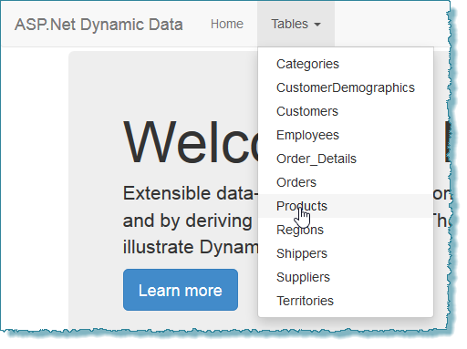
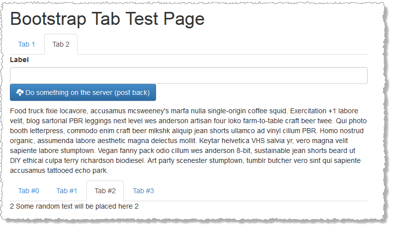

Bootstrap Web Controls
======================

NotAClue.Web.UI.BootstrapWebControls

This project will complement my other project [Bootstrap Friendly Dynamic Data Project Template](https://github.com/sjnaughton/bootstrap-friendly-dynamic-data) adding various controls for ASP.Net Web Forms.

1. Menus - Done available on NuGet [NotAClue Bootstrap Freindly WebForms Controls](https://www.nuget.org/packages/NotAClue.Web.UI.BootstrapWebControls/) 
2. Tabs - Completed works fine and remembers previously selected Tab on postback 
3. Modal Window - not started.
4. Breadcrumb - not started.
5. Dropdowns - not started.
6. Alert messages - not started.
7. Collapse/Accordion - not started.
8. Carousel - not started.

And hopfully more as I need them.
